# H Design 色彩原文与图示

来源：[色彩.docx](色彩.docx)。以下按 Word 原有顺序保留所有正文、色值和 20 张原图；原文中的术语、示例及互相不一致的标注不作覆盖式修订。可执行变量、图中 Token 转录和差异处理见 [颜色映射与使用规则](h-design-color-mappings.md)。

## 组件高亮色

组件高亮色是指在用户界面中用于突出强调某个组件元素或交互状态的特定颜色，可以用于如按钮、链接、标签、选中状态、焦点状态、悬停状态等，以增强交互效果和可视化反馈。

### 用于软件产品

在软件产品中，我们采用蓝色#0067D1为默认的组件高亮色，并以此颜色延展出其他相关交互状态颜色。选择此颜色不仅是由于蓝色相较于其他颜色具有更广的普适性和接受度，更加关键的是，蓝色#0067D1具有足够的对比度，可保证在不同屏幕和环境下的可读性和可见性。此外，对于视障人群，蓝色也依然能保障清晰的识别度。 

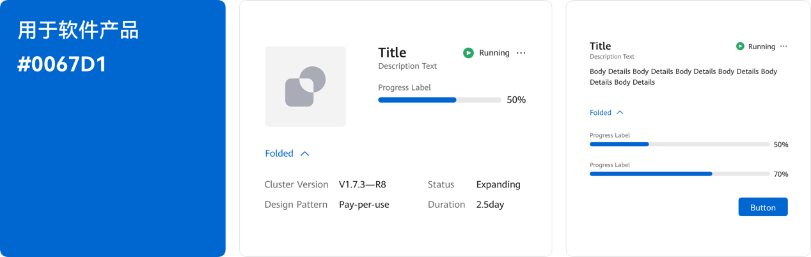

### 用于门户官网

门户官网场景建议统一使用深灰色#191919作为高亮色使用。门户网站通常会有大量图像内容和信息需要呈现，选择更加稳重和沉稳的深灰色#191919作为官网门户的组件高亮色，可以为用户提供更加舒适和稳定的浏览体验。

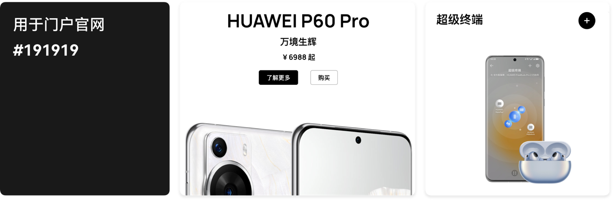

## 公司辅助色

公司辅助色分为两大类：一类为灰色系公司辅助色、一类为彩色系公司辅助色。 本规范的公司辅助色基于《华为视觉识别规范手册》V2.0 的原有辅助色色值在数字场景下进行了适配，提高明度与饱和度，并对色相进行了延展。

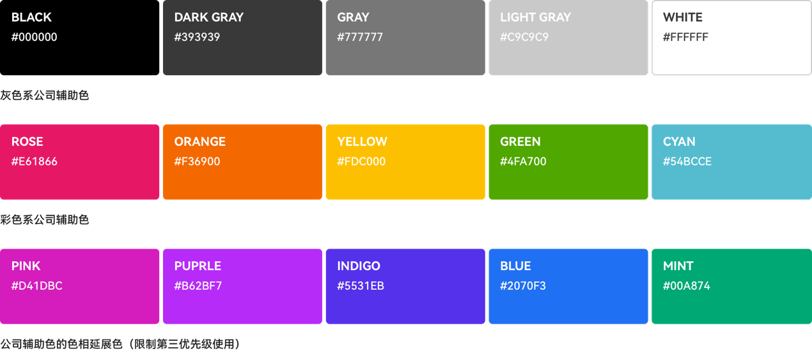

## UI色彩应用指南

H Design 色彩规范以Color Token的方式管理所有UI场景用色，将色彩命名与实际用途、语义相结合，贯穿设计与开发工作流。这不仅有利于帮助我们了解如何使用颜色，也能最大程度地减少未来色彩系统演进与更新后的维护成本。场景配色方案是整个色彩系统的核心，也是设计过程中实际运用在UI界面里的颜色。 有关Color Token完整列表和使用描述，请查阅设计参数列表。

### 高亮色

高亮色常用语界面中需要突出的重要操作项，如按钮、文本链接等其他关键功能。

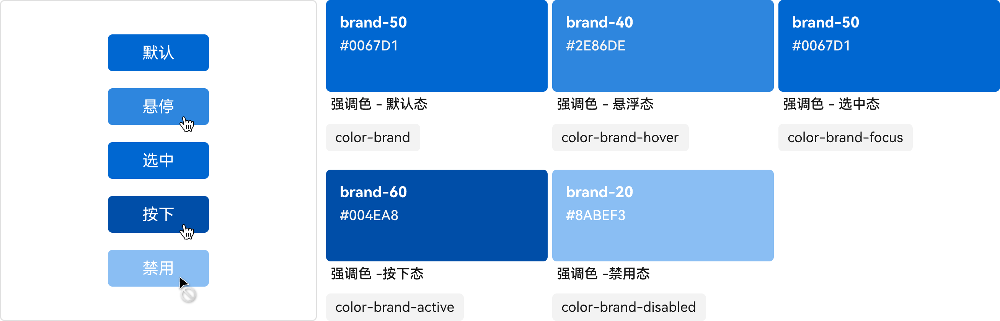

### 文本色

区分不同层级的文本色可用于增加文字的对比度，即使文本大小和重量相同，也能够突出文本之间的层次结构。

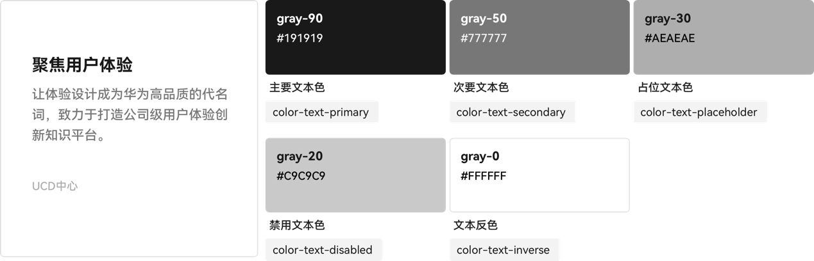

### 图标色

操作图标常与文本组合使用，整体颜色层级与文本色相匹配。

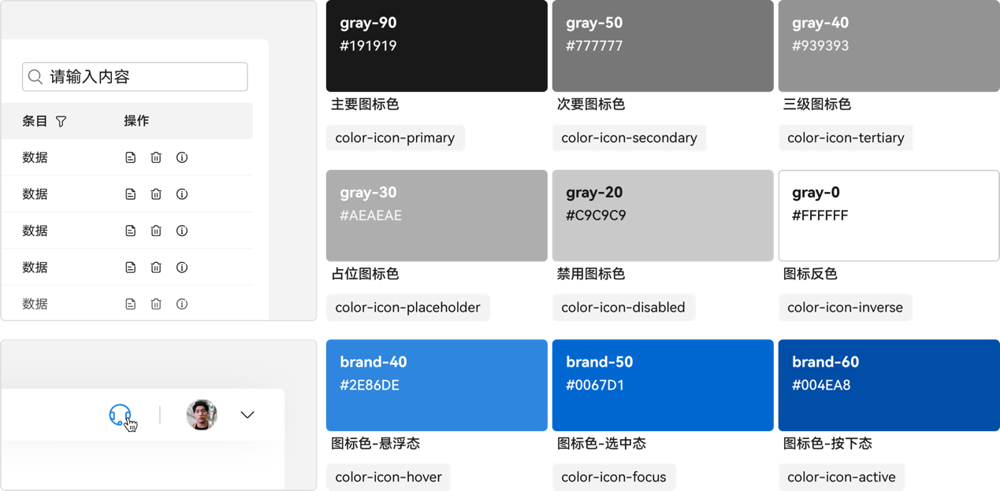

### 边框色

边框和分割线帮助我们在界面和组件中组织和区分信息区域，我们为不同交互状态提供了不同的边框反馈颜色。

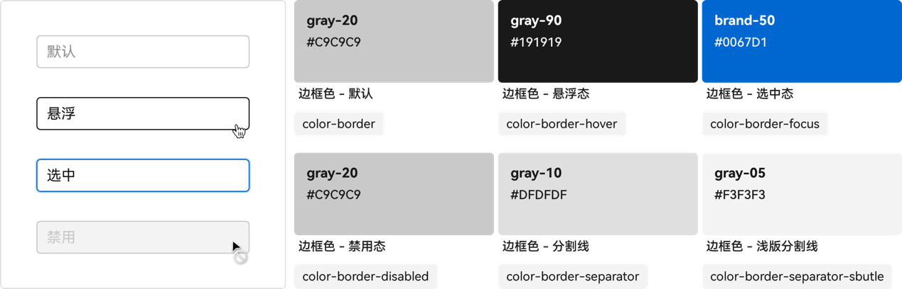

### 背景色

背景色用于各类容器的填充，不同深浅的中性色给页面的背景填充提供足够的灵活度。

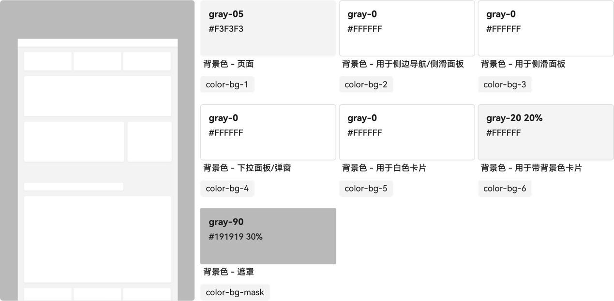

### 填充色

填充色主要用于各类组件的填充，不同深浅的填充色可代表组件的不同交互状态。

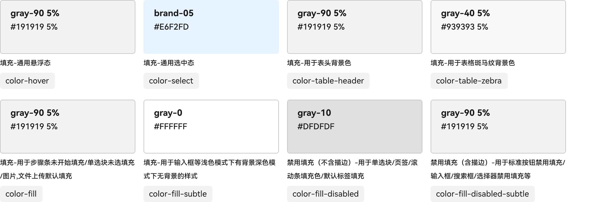

### 功能色

功能色在产品中主要用于向用户传递信息/通知的各类组件，我们从“信息的紧迫性”和“用户需要关注的级别”这两个角度将功能色分为三个级别：高、中和低关注度。

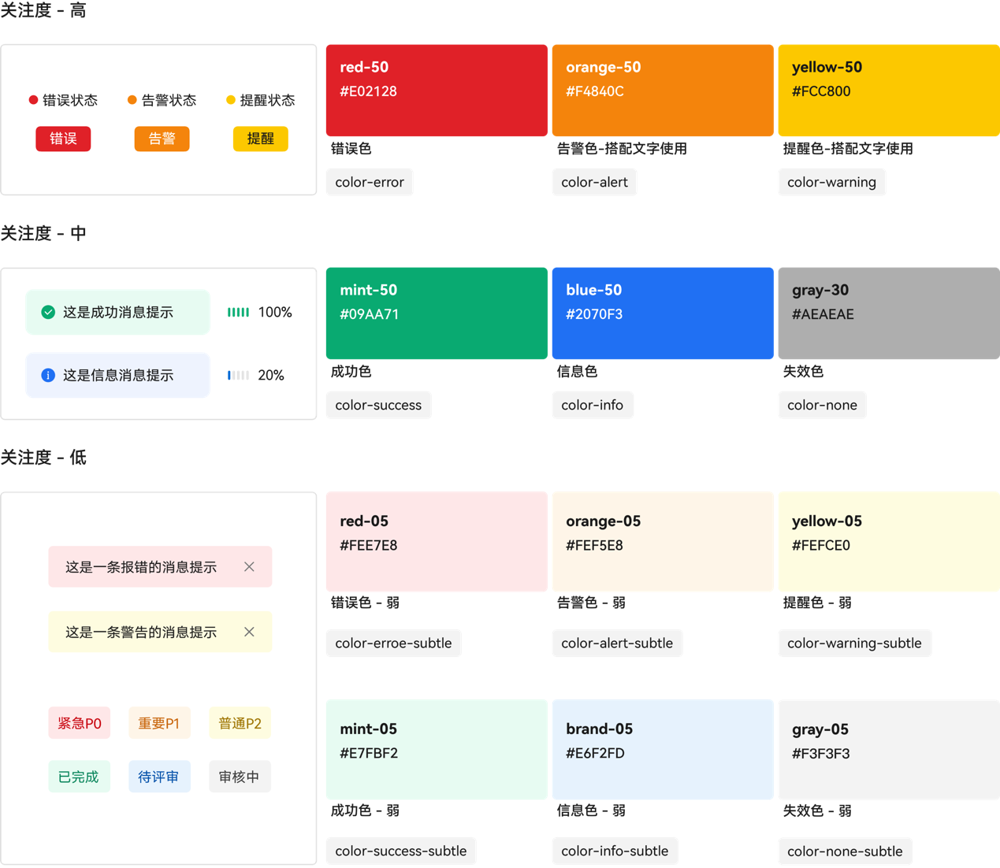

## 图表色应用指南

在图表的使用过程中，经常会需要根据不同的数据分类或维度，选择适合的几种颜色应用于图表中，因此我们经过精心的挑选，提供了基础图表色板，同色相取色规则以及单双色渐变规则可供选择使用。

### 默认配色方案

在对图表进行色彩搭配时，优先使用以下6色基础图表色板，从左到右按顺序使用。

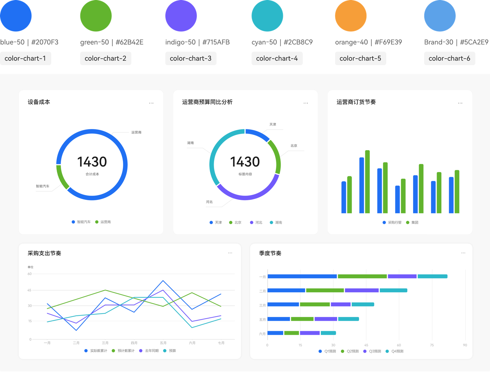

### 尾部色

在环形图和堆叠柱状图中，当颜色数量大于6个以上时使用，可根据业务场景选择尾部色将替换为最后一个颜色。

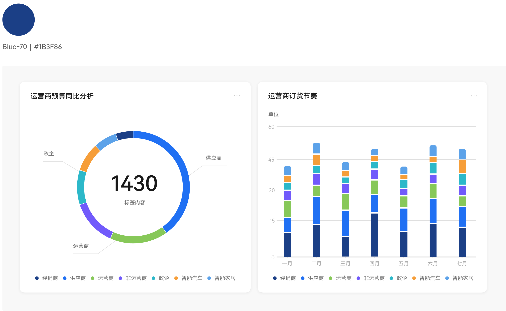

### 无障碍配色方案

考虑到色彩障碍人群对色彩的感知度有限，根据网页内容可访问性指南（WCAG），H Design 色彩系统优化了默认图表配色，以满足用户对色彩的辨识度。 WCAG AA 标准对比度规则： 对于小于24px的任意大小的界面文本与图形元素，需要满足4.5:1的对比度( WCAG 1.4.3 ) 对于大于24px的任意大小的界面文本与图形元素，需要满足3:1 的对比度( WCAG 1.4.11 )

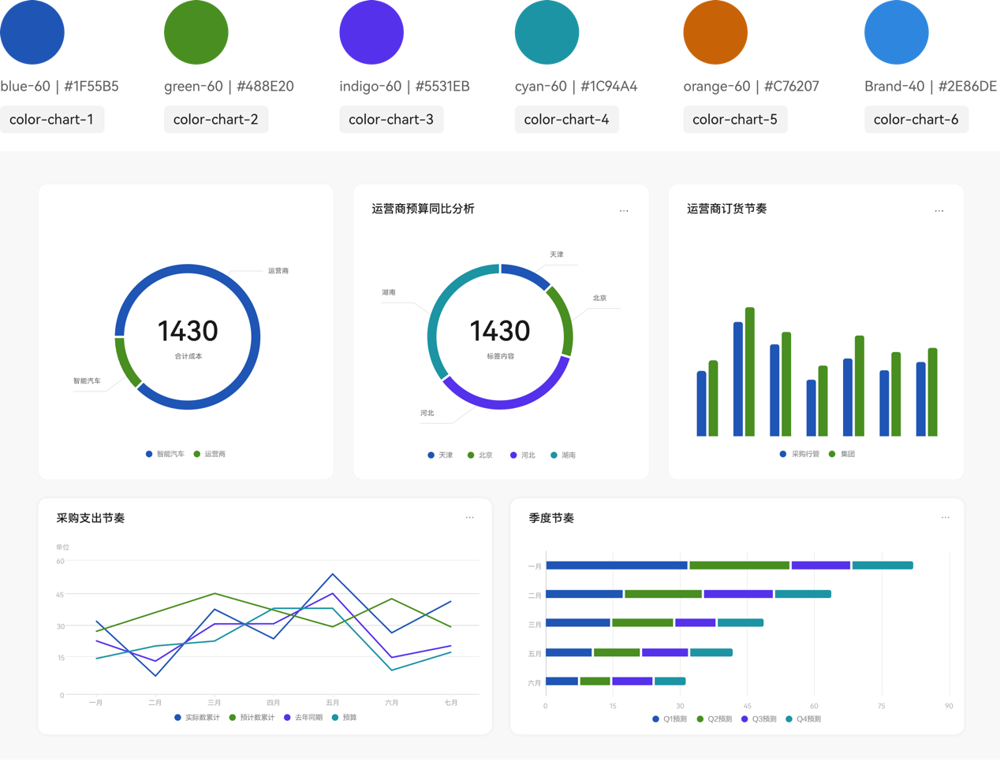

### 配色方案延展

根据以上的“取色规则”，以“50-40-50-40……”的顺序，可依据实际业务情况对色相进行替换。

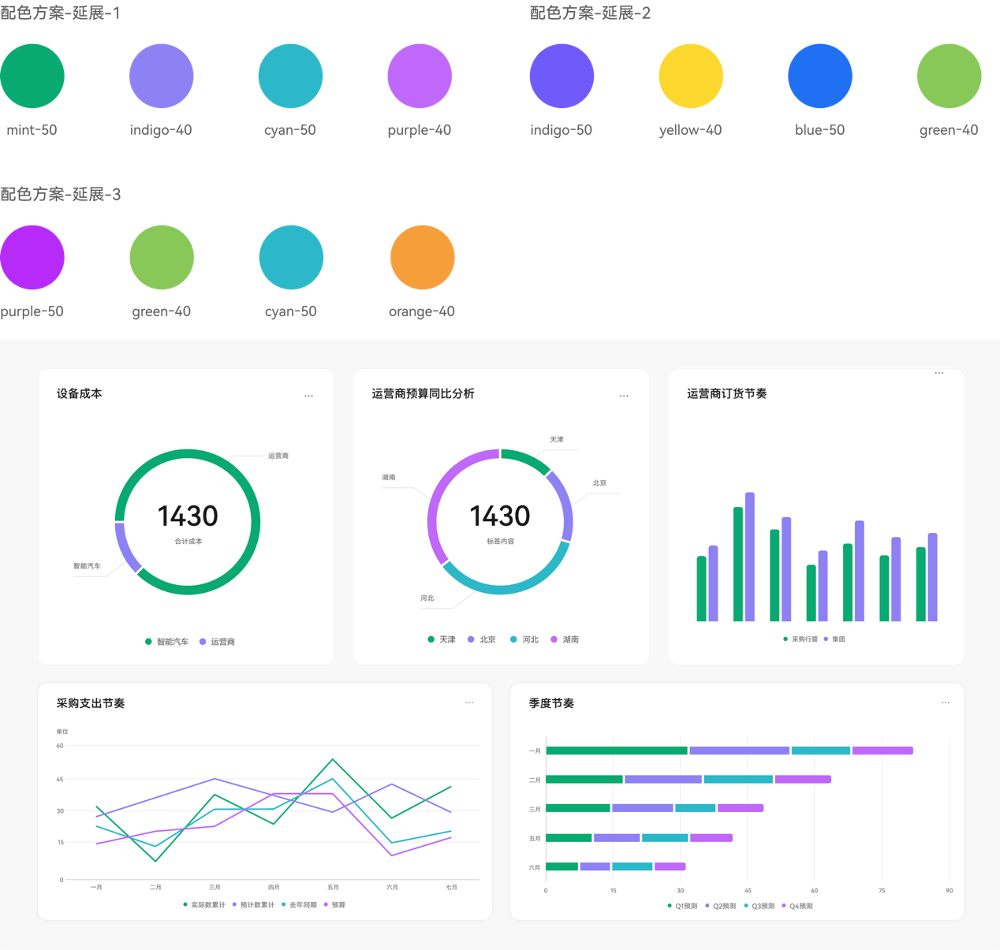

### 同类色取色规则

同色相取色规则由该色相的 Color-10 至 Color-70 之间共7个色彩，按照以下图例规则来进行搭配组合。

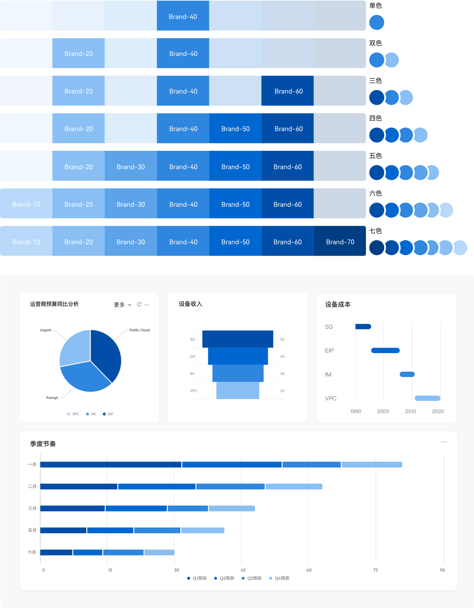

### 单色渐变 - 取色规则

选取该色相内，色号的 Color-30 & Color-50 来应用至实际场景中。 ToB 场景下，图表以数据精准性为核心，不建议使用渐变色，避免视觉干扰导致数据解读偏差。 ToC 场景可按需运用渐变色，但不可单纯作为装饰元素；需结合业务逻辑赋予表意，例如仪表盘可借助渐变体现数据走势、告警区间趋近等状态含义。

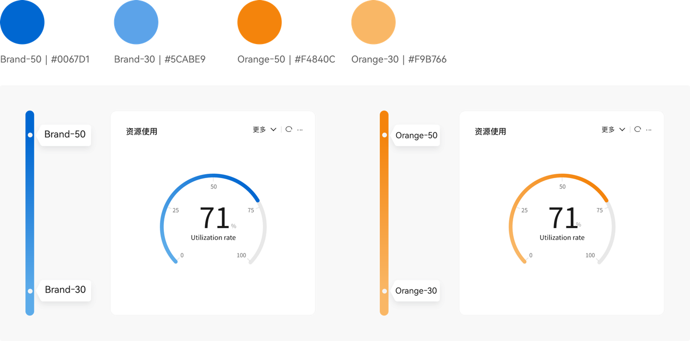

### 双色渐变 - 取色规则

推荐以三组相互关系为邻近色来使用，取色统一为 “Color-50”。 ToB 场景下，图表以数据精准性为核心，不建议使用渐变色，避免视觉干扰导致数据解读偏差。 ToC 场景可按需运用渐变色，但不可单纯作为装饰元素；需结合业务逻辑赋予表意，例如仪表盘可借助渐变体现数据走势、告警区间趋近等状态含义。

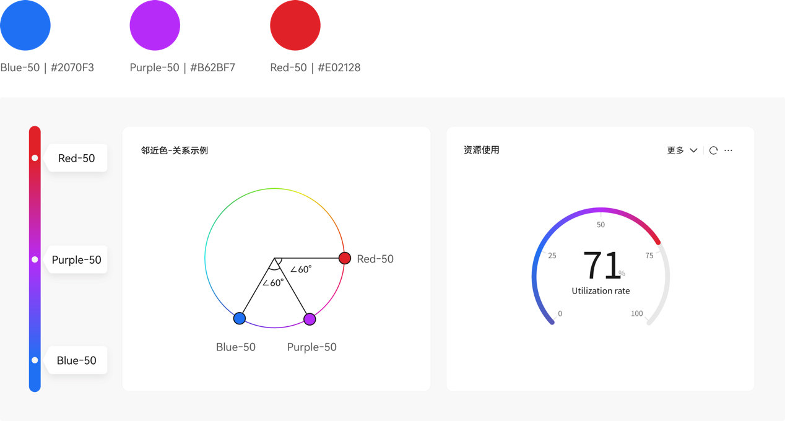

## 代码色应用指南 

StarCode 星辰代码配色主题，从 H Design 数字场景色板精选了适用于代码语法领域的色值，并同时面向 Web 和 IDE 的使用场景构建了色彩的语义化映射。设计师可在实际使用时，基于代码类型确定具体色值，并通过本规范提供的规范资源和开发建立协作流程，实现好用又好看的代码配色。

### 语法类型和对应色板

构建代码语法高亮配色方案的第一步是对常见语法进行分类，分类的基础源自Highlight.js 的命名系统。 

Highlight.js 是一个用于网页代码语法高亮的 JavaScript 库。它通过自动检测代码语言并应用不同的样式来高亮代码片段，使网页上的代码更易于阅读。它被广泛应用于技术博客、文档网站和代码编辑器等场景，优势是轻量级和易于集成。

经过归纳，当前常用的语法类型共计 9 大类，包含约 35 个 hljs 类名（后续将基于用户场景和业务持续新增），将 H Design 中选定的 Color Token 与 Highlight.js 内置类名进行绑定，可得到下图所示的映射关系。我们看到的 .hljs-comment，.hljs-function 等名称就是 Highlight.js 的语法类名，而“注释内容”、“程序结构”是语法聚类后的大类名称。

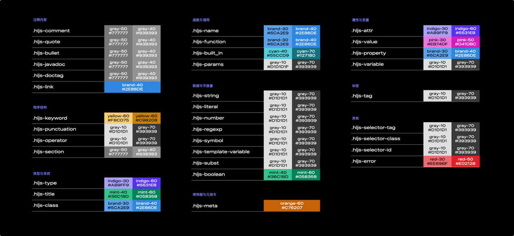

值得注意的是，我们需要尽可能减少色相数量，以提升代码观感，使其更简约耐看。因此，在无需特别强调的语法类型中，建议使用灰阶区分主次。例如，在“数据与字面量”大类下的 string、literal、number 等语法均被赋予了灰色，而带有判断逻辑的 boolean 则被赋予了薄荷绿，而注释内容，如 comment，quote 等相较于其他类型优先级最低，因此使用明度更小的灰色。

建议各领域设计师以上述介绍的配色逻辑为基础，同时针对具体业务场景中需要重点强调的语法类型进行高亮。经测试，被高亮的语法类型比例不建议超过 80%，使用的色相数量不建议超过 10 种，否则将导致代码可读性和观感品质显著下降。

### 语义映射表

本色板需要支持 Web 和集成开发环境（IDE）2 类典型代码显示场景，因此仅有基于 Highlight.js 构建的映射关系是不够的。Highlight.js 虽面向的场景较多，但难以进行更精细的语法类型识别和定义。

例如在下图展示的映射关系中，“类型与系统”类主要支持的语法类型主要为 .hljs-type，.hljs-title，.hljs-class，但在像 DevEco 这样的 IDE 软件中，可以实现更多且精细的类型配置，如 Interface，Class，Enum，Type parameter 等。像这类配置颗粒度的差异，会导致 Web 和 IDE 场景无法有效的使用同一套色板。

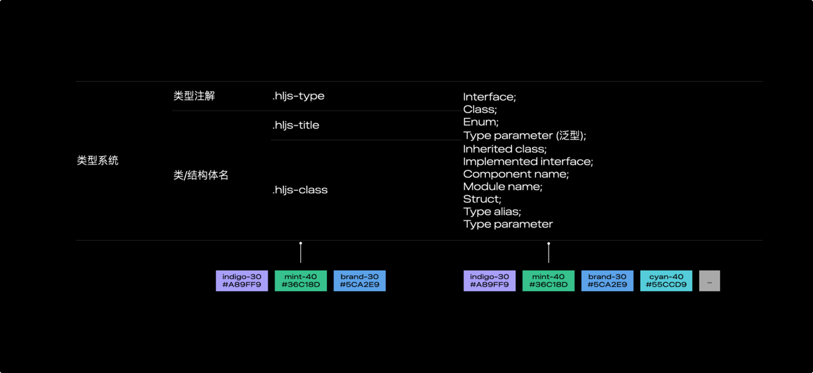

因此我们需要一个基于语义的映射系统，不仅能同时包含 Web 和 IDE 场景中支持的主要配置项，还能构建起两者之间的映射关系，并以此为基础提供建议的颜色。

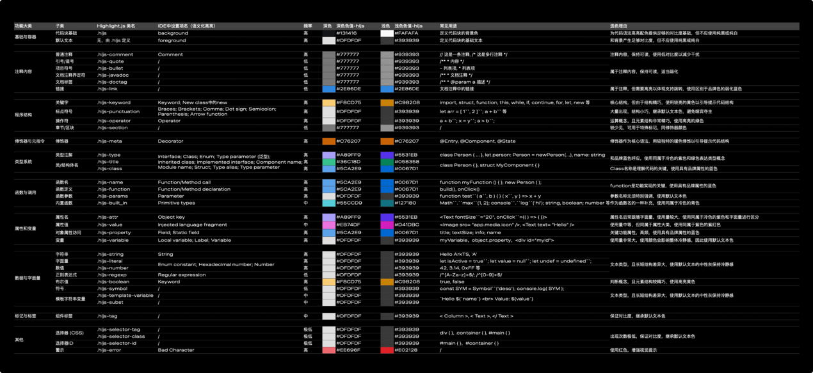

上图所示的表格即为语义映射表，从左至右分别呈现了“功能大类，功能子类，Highlight.js 类名，IDE 设置项名，频率，深色色值，浅色色值，常见用途示例和选色理由。表格顺序代表了实际选色的思考逻辑，具体如下：

第 1 步：当需要确定某个语法的高亮色值时，优先确定该语法所在的功能大类和子类。例如，在 ArkTS 语言中，“import”属于程序结构中的关键字类型。

第 2 步：明确功能大类和子类后，基于业务场景查看 Highlight.js 类名或 IDE 设置项名（网页场景：Highlight.js，IDE 场景 ：IDE 设置项名）。例如，“import”的 Highlight.js 类名为 .hljs-keyword，IDE 设置项名一般为 Keyword。值得注意的是，表格中的 IDE 设置项名基于 DevEco 整理而成，并不代表行业所有集成开发发软件，实际使用时可能存在出入。

第 3 步：明确深色和浅色模式下对应的色值。例如，“import”的色值在深色模式下为“#F8CD75"，浅色模式下为“#C98208”。右侧的“场景用途”和“选色理由”供设计师在敲定色值前确认类型是否有误。

通过上述方法，即可完成对某一种语法类型的配色。同时，建议设计师在落地阶段始终基于这份语义映射表和开发、测试同事进行沟通和编辑，这将极大提高协作和落地效率。

## 公司色板

以下色板是基于公司色彩在数字场景下的延展和适配。我们将色板从浅到深依次分成12个梯度 - 黑色，白色和每种色调的10个值。在色彩命名上默认使用此颜色的字面名称，如红色、橙色等，加上数字刻度，如50、90等，其中90是该梯度中色调最暗沉的色彩，05是该梯度中色调最明亮的色彩。

rose-05

#FEE5F2

rose-10

#FCC3E0

rose-20

#F99AC7

rose-30

#F470AB

rose-40

#ED448A

rose-50

#E61866

rose-60

#C40054

rose-70

#811439

rose-80

#540D24

rose-90

#330614

red-05

#FEE7E8

red-10

#FABDC1

red-20

#F59297

red-30

#EE696F

red-40

#E7434A

red-50

#E02128

red-60

#C7000B

red-70

#850F12

red-80

#59080A

red-90

#350305

orange-05

#FEF5E8

orange-10

#FDE2BD

orange-20

#FCCE92

orange-30

#F9B766

orange-40

#F69E39

orange-50

#F4840C

orange-60

#C76207

orange-70

#954304

orange-80

#642802

orange-90

#3D1601

yellow-05

#FEFCE0

yellow-10

#FEF8B8

yellow-20

#FEF08A

yellow-30

#FDE55C

yellow-40

#FCD72E

yellow-50

#FCC800

yellow-60

#D19F00

yellow-70

#9E7400

yellow-80

#614500

yellow-90

#2E1F00

green-05

#F2FBE9

green-10

#DFF4CC

green-20

#C6E9A8

green-30

#A8DB81

green-40

#87C859

green-50

#62B42E

green-60

#488E20

green-70

#316614

green-80

#1B3E0A

green-90

#0C2004

mint-05

#E7FBF2

mint-10

#BCF2DB

mint-20

#8FE5C2

mint-30

#63D5A8

mint-40

#36C18D

mint-50

#09AA71

mint-60

#058358

mint-70

#036142

mint-80

#02422E

mint-90

#00291D

cyan-05

#E8FCFD

cyan-10

#C9F6F9

cyan-20

#A4ECF1

cyan-30

#7DDFE7

cyan-40

#55CCD9

cyan-50

#2CB8C9

cyan-60

#1C94A4

cyan-70

#127180

cyan-80

#094C57

cyan-90

#04282F

blue-05

#EEF3FE

blue-10

#D0D8FD

blue-20

#B0BFFD

blue-30

#8CA3FA

blue-40

#668CF7

blue-50

#2070F3

blue-60

#1F55B5

blue-70

#1B3F86

blue-80

#112857

blue-90

#081635

indigo-05

#EEEEFE

indigo-10

#D5D3FD

indigo-20

#BFB9FA

indigo-30

#A89FF9

indigo-40

#8E81F4

indigo-50

#715AFB

indigo-60

#5531EB

indigo-70

#3F21B5

indigo-80

#281675

indigo-90

#160B48

purple-05

#F7EDFE

purple-10

#E8CFFE

purple-20

#D9B1FD

purple-30

#CB8EFB

purple-40

#BF68FA

purple-50

#B62BF7

purple-60

#8A21BC

purple-70

#651B8B

purple-80

#41125A

purple-90

#260937

pink-05

#FDE6FC

pink-10

#F9C5F6

pink-20

#F39DEC

pink-30

#EB74DF

pink-40

#E049CE

pink-50

#D41DBC

pink-60

#9F1C8D

pink-70

#751868

pink-80

#4C0F43

pink-90

#2E0728

brand-05

#E6F2FD

brand-10

#B8D9F9

brand-20

#8ABEF3

brand-30

#5CA2E9

brand-40

#2E86DE

brand-50

#0067D1

brand-60

#004EA8

brand-70

#003D83

brand-80

#002E6A

brand-90

#00214B

gray-0White

#FFFFFF

gray-05

#F3F3F3

gray-10

#DFDFDF

gray-20

#C9C9C9

gray-30

#AEAEAE

gray-40

#939393

gray-50

#777777

gray-60

#595959

gray-70

#393939

gray-80

#2A2A2A

gray-90

#191919

gray-100Black

#000000
